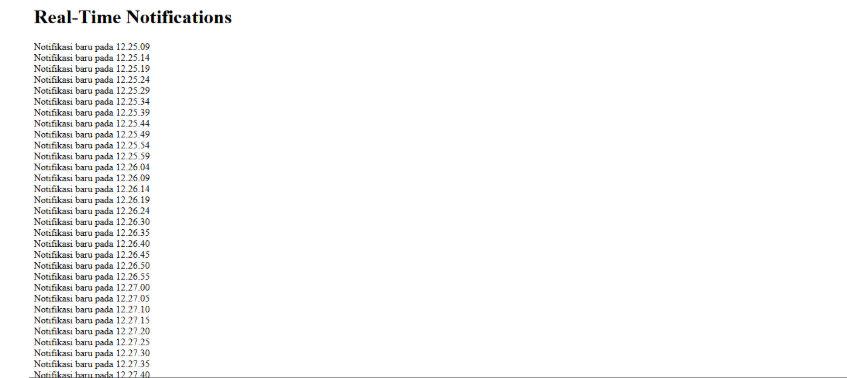

|Nama|NIM|Kelas|Mata Kuliah|
|----|---|-----|------|
|**Bagas Prihantoro Putra**|**312310599**|**TI.23.A6**|**Pemrograman Web 2**|

# Pembahasan Utama
## 1. Persiapan Lingkungan Pengembangan
### • Instal Node.js: Download dan instal Node.js dari nodejs.org.
### • Instal Pustaka WebSocket: Jalankan perintah berikut untuk menginstal pustaka WebSocket:
```bash
npm install ws
```
## 2. Membuat Server WebSocket (server.js)
### • Buat file server.js dengan kode berikut :
```javascript
const WebSocket = require("ws");
const wss = new WebSocket.Server({ port: 8080 });

wss.on("connection", (ws) => {
  console.log("A user connected");

  setInterval(() => {
    const message = `Notifikasi baru pada ${new Date().toLocaleTimeString()}`;
    ws.send(message);
  }, 5000);

  ws.on("close", () => {
    console.log("A user disconnected");
  });
});

console.log("WebSocket server is running on ws://localhost:8080");
```
### • Jalankan server menggunakan :
```bash
node server.js
```
## 3. Membuat Klien WebSocket (index.html)
### • Buat file index.html dengan kode berikut :
```html
<!DOCTYPE html>
<html lang="en">
<head>
    <meta charset="UTF-8">
    <meta name="viewport" content="width=device-width, initial-scale=1.0">
    <title>WebSocket Real-Time Notifications</title>
</head>
<body>
    <h1>Real-Time Notifications</h1>
    <div id="notifications"></div>

    <script>
        const socket = new WebSocket('ws://localhost:8080');

        socket.onopen = () => {
            console.log('Connected to WebSocket server');
        };

        socket.onmessage = (event) => {
            const notificationsDiv = document.getElementById('notifications');
            const notification = document.createElement('div');
            notification.textContent = event.data;
            notificationsDiv.appendChild(notification);
        };

        socket.onclose = () => {
            console.log('Disconnected from WebSocket server');
        };
    </script>
</body>
</html>
```
## 4.Menjalankan Aplikasi
### • Jalankan Server: Di terminal, jalankan :
```bash
node server.js
```
### • Buka Klien di Browser: Buka index.html di browser untuk melihat notifikasi yang dikirim setiap 5 detik.

# Output


